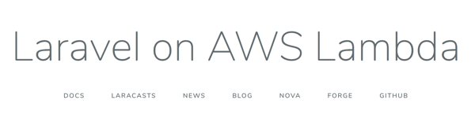

# Serverless PHP



This is an example repository how you can use PHP functions, console commands and Laravel application on AWS Lambda.

## Requirements

* Composer
* PHP >= 7.2 ([jalendport/switch-php](https://github.com/jalendport/switch-php) package can help you)
* [AWS CLI](https://docs.aws.amazon.com/cli/latest/userguide/cli-chap-install.html)
* [AWS SAM CLI](https://aws.amazon.com/serverless/sam/)

## Laravel Application

### Production

https://14d0eykyk9.execute-api.eu-west-1.amazonaws.com/Prod/

### Locally
- Run
```
$ cp .env.production .env
$ sam local start-api --region eu-west-1
```
 - Visit http://127.0.0.1:3000/

### How to Deploy?

 ```
 $ composer lambda-build
 ```

## PHP Functions & Console

Checkout `feature/laravel-zero` branch

## Resources

* [Bref package](https://bref.sh/)
* [Serverless toolkit](https://serverless.com/)
* [Serverless Laravel | Matthieu Napoli](https://mnapoli.fr/serverless-laravel/)
* [Serverless and PHP: Performances | Matthieu Napoli](https://mnapoli.fr/serverless-php-performances/)
* [I’m afraid you’re thinking about AWS Lambda cold starts all wrong
](https://hackernoon.com/im-afraid-you-re-thinking-about-aws-lambda-cold-starts-all-wrong-7d907f278a4f)
